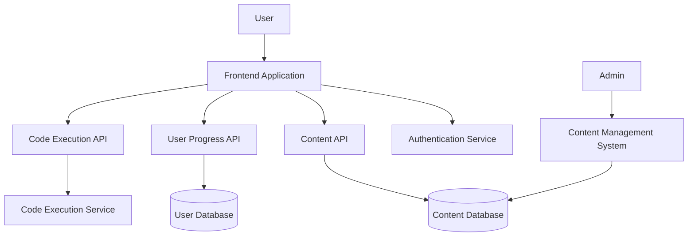

# Design Document: Interactive Learning Platform

## Overview

The Interactive Learning Platform is designed to be a comprehensive, engaging web application that helps users practice and master various programming concepts through gamified experiences. Building upon the existing AWS Cloud Practitioner exam preparation functionality, this platform will expand to cover a wide range of programming languages, software development topics, and career preparation resources.

The platform will feature a modular architecture that allows for easy expansion of content areas while maintaining a consistent, game-like user experience. The design emphasizes engagement, accessibility, and personalization to keep users motivated in their learning journey.

## Architecture

### High-Level Architecture

The Interactive Learning Platform will follow a modern web application architecture with the following components:

1. **Frontend Layer**
   - Single Page Application (SPA) built with modern JavaScript frameworks
   - Responsive design for cross-device compatibility
   - Game-like UI components for engagement

2. **Backend Layer**
   - RESTful API services for data access and business logic
   - Authentication and user management services
   - Content delivery and management services

3. **Data Layer**
   - User data storage (progress, achievements, preferences)
   - Content storage (questions, challenges, learning materials)
   - Analytics data storage

4. **External Services**
   - Code execution environment for programming challenges
   - Authentication providers
   - Content delivery network (CDN)

### System Architecture Diagram



## Components and Interfaces

### Frontend Components

1. **Core UI Framework**
   - Game-styled navigation and interface
   - Achievement and progress visualization
   - Responsive layout system

2. **Learning Path Navigator**
   - Visual representation of learning paths
   - Progress tracking and visualization
   - Path selection and recommendation engine

3. **Content Modules**
   - AWS Certification Module (existing, to be enhanced)
   - Programming Language Practice Module
   - Interview Preparation Module
   - Cybersecurity Challenge Module

4. **Interactive Code Editor**
   - Syntax highlighting for multiple languages
   - Real-time code execution and feedback
   - Test case runner and visualizer

5. **User Dashboard**
   - Progress tracking across all modules
   - Achievement and badge display
   - Learning recommendations
   - Personal goal setting and tracking

### Backend Services

1. **Authentication Service**
   - User registration and login
   - Session management
   - Role-based access control

2. **Content Service**
   - Content retrieval and delivery
   - Content filtering and search
   - Content recommendation engine

3. **User Progress Service**
   - Progress tracking and storage
   - Achievement and badge management
   - Learning analytics

4. **Code Execution Service**
   - Secure code execution environment
   - Multiple language support
   - Test case validation

5. **Analytics Service**
   - User behavior tracking
   - Learning effectiveness metrics
   - Platform usage statistics

### External Interfaces

1. **Code Execution API**
   - Interface for executing user code in various languages
   - Security sandboxing for code execution
   - Test case validation and feedback generation

2. **Content Management System (CMS) API**
   - Interface for content creators to add and update learning materials
   - Content versioning and publishing workflow
   - Content analytics and effectiveness metrics

## Data Models

### User Model

```json
{
  "userId": "string",
  "username": "string",
  "email": "string",
  "profile": {
    "displayName": "string",
    "avatar": "string",
    "preferences": {
      "theme": "string",
      "notifications": "boolean"
    }
  },
  "progress": {
    "completedModules": ["string"],
    "currentModules": [
      {
        "moduleId": "string",
        "progress": "number",
        "lastAccessed": "timestamp"
      }
    ]
  },
  "achievements": [
    {
      "achievementId": "string",
      "dateEarned": "timestamp"
    }
  ],
  "statistics": {
    "totalPoints": "number",
    "streak": "number",
    "timeSpent": "number"
  }
}
```

### Learning Module Model

```json
{
  "moduleId": "string",
  "title": "string",
  "description": "string",
  "category": "string",
  "difficulty": "string",
  "prerequisites": ["string"],
  "content": {
    "sections": [
      {
        "sectionId": "string",
        "title": "string",
        "type": "string", // "lesson", "quiz", "challenge", etc.
        "content": "object" // Structure depends on type
      }
    ]
  },
  "metadata": {
    "createdAt": "timestamp",
    "updatedAt": "timestamp",
    "version": "string",
    "tags": ["string"]
  }
}
```

### Challenge Model

```json
{
  "challengeId": "string",
  "title": "string",
  "description": "string",
  "type": "string", // "quiz", "coding", "security", etc.
  "difficulty": "string",
  "points": "number",
  "timeLimit": "number", // in seconds, optional
  "content": {
    // For quiz type
    "questions": [
      {
        "questionId": "string",
        "text": "string",
        "options": ["string"],
        "correctAnswer": "string or number",
        "explanation": "string"
      }
    ],
    // For coding type
    "codingProblem": {
      "prompt": "string",
      "starterCode": "string",
      "language": "string",
      "testCases": [
        {
          "input": "string",
          "expectedOutput": "string",
          "isHidden": "boolean"
        }
      ]
    },
    // For security challenge type
    "securityChallenge": {
      "scenario": "string",
      "environment": "object",
      "objectives": ["string"],
      "hints": ["string"]
    }
  }
}
```

### Achievement Model

```json
{
  "achievementId": "string",
  "title": "string",
  "description": "string",
  "icon": "string",
  "criteria": {
    "type": "string", // "completion", "streak", "score", etc.
    "threshold": "number",
    "moduleId": "string" // optional, for module-specific achievements
  },
  "rewards": {
    "points": "number",
    "unlocks": ["string"] // IDs of content unlocked by this achievement
  }
}
```

## Error Handling

### Frontend Error Handling

1. **User Input Validation**
   - Client-side validation for all user inputs
   - Clear error messages with suggestions for correction
   - Form field highlighting for invalid inputs

2. **API Error Handling**
   - Graceful degradation when API calls fail
   - Retry mechanisms for transient errors
   - Offline mode support with local storage

3. **Code Execution Errors**
   - Syntax error highlighting in code editor
   - Runtime error display with line numbers
   - Helpful error messages with learning resources

### Backend Error Handling

1. **API Error Responses**
   - Consistent error response format
   - Appropriate HTTP status codes
   - Detailed error messages for debugging

2. **Service Failures**
   - Circuit breaker pattern for dependent services
   - Fallback mechanisms for critical features
   - Logging and monitoring for error detection

3. **Security Error Handling**
   - Rate limiting for authentication attempts
   - Secure error messages (no sensitive information)
   - Audit logging for security-related errors

## Testing Strategy

### Frontend Testing

1. **Unit Testing**
   - Component-level tests for UI elements
   - Service-level tests for data handling
   - Mock API responses for consistent testing

2. **Integration Testing**
   - Component interaction tests
   - Form submission and validation tests
   - Navigation flow tests

3. **End-to-End Testing**
   - User journey tests for critical paths
   - Cross-browser compatibility tests
   - Responsive design tests

### Backend Testing

1. **Unit Testing**
   - Service function tests
   - Data model validation tests
   - Utility function tests

2. **Integration Testing**
   - API endpoint tests
   - Database interaction tests
   - External service integration tests

3. **Performance Testing**
   - Load testing for concurrent users
   - Response time benchmarking
   - Resource utilization monitoring

### Security Testing

1. **Authentication Testing**
   - Login/logout flow tests
   - Permission boundary tests
   - Session management tests

2. **Code Execution Security**
   - Sandbox escape attempts
   - Resource limit testing
   - Malicious code detection tests

3. **Data Protection**
   - Input sanitization tests
   - XSS and CSRF prevention tests
   - Data encryption verification

## User Experience Design

### Game-Like Interface

The platform will feature a game-like interface with the following elements:

1. **Visual Learning Map**
   - Interactive "world map" of learning paths
   - Unlockable areas based on progress
   - Visual indicators of completed and available content

2. **Achievement System**
   - Badges and trophies for accomplishments
   - Progress bars and level indicators
   - Milestone celebrations and rewards

3. **Personalized Avatar**
   - Customizable user representation
   - Unlockable avatar items through achievements
   - Visual progression reflecting user's journey

### Learning Experience

1. **Adaptive Difficulty**
   - Dynamic adjustment based on user performance
   - Optional hints and scaffolding for struggling users
   - Challenge modes for advanced users

2. **Immediate Feedback**
   - Real-time feedback on code execution
   - Detailed explanations for quiz answers
   - Progress visualization after each activity

3. **Social Learning**
   - Optional leaderboards for competitive motivation
   - Sharing achievements on social media
   - Collaborative challenges (future enhancement)

## Content Strategy

### AWS Certification Content

1. **Enhanced Existing Content**
   - Expanded question bank with categorization
   - Detailed explanations with visual aids
   - Practice exam simulation with timing

2. **Additional AWS Certifications**
   - Solutions Architect Professional
   - DevOps Engineer
   - Security Specialty
   - Other AWS certification paths

### Programming Language Content

1. **Language Fundamentals**
   - Syntax and basic concepts
   - Common patterns and idioms
   - Best practices and style guides

2. **Practical Challenges**
   - Algorithm implementations
   - Data structure manipulations
   - Real-world problem solving

3. **Project-Based Learning**
   - Guided project implementations
   - Code review and improvement exercises
   - Portfolio-worthy project challenges

### Interview Preparation Content

1. **Technical Interview Questions**
   - Role-specific question banks
   - Coding interview challenges
   - System design exercises

2. **Behavioral Questions**
   - Common scenario responses
   - STAR method practice
   - Mock interview simulations

3. **Career Resources**
   - Resume and portfolio building
   - Job search strategies
   - Negotiation techniques

### Cybersecurity Challenge Content

1. **"Hacknet" Simulation**
   - Terminal-based challenges
   - Network security scenarios
   - Ethical hacking exercises

2. **Security Concepts**
   - Authentication and authorization
   - Encryption and secure communication
   - Vulnerability assessment

3. **CTF-Style Challenges**
   - Flag hunting exercises
   - Security puzzle solving
   - Progressive difficulty levels

## Implementation Considerations

### Initial Phase Focus

For the initial implementation, we will focus on:

1. Core platform infrastructure and game-like UI
2. Enhanced AWS certification module (building on existing code)
3. Basic programming practice module with 2-3 languages
4. Foundational cybersecurity challenges

### Technology Stack

1. **Frontend**
   - HTML5, CSS3, JavaScript
   - Modern framework (React or Vue.js)
   - Canvas/WebGL for game-like elements

2. **Backend**
   - Node.js or Python for API services
   - Express.js or FastAPI for API framework
   - MongoDB or PostgreSQL for data storage

3. **Code Execution**
   - Containerized execution environment
   - Language-specific compilers and interpreters
   - Secure sandboxing solution

### Offline Support

1. **Progressive Web App (PWA)**
   - Service worker for offline functionality
   - Local storage for user progress
   - Sync mechanisms for reconnection

2. **Content Caching**
   - Downloadable content packages
   - Efficient storage management
   - Version control for updates

### Accessibility

1. **WCAG Compliance**
   - Keyboard navigation support
   - Screen reader compatibility
   - Color contrast and text sizing

2. **Inclusive Design**
   - Alternative content formats
   - Customizable UI settings
   - Language localization support

## Future Enhancements

1. **Mobile Applications**
   - Native iOS and Android apps
   - Cross-platform progress synchronization
   - Mobile-specific learning experiences

2. **AI-Powered Learning**
   - Personalized learning paths
   - Intelligent content recommendations
   - Automated code review and feedback

3. **Virtual Reality Learning**
   - Immersive learning environments
   - 3D visualization of complex concepts
   - Collaborative VR learning spaces

4. **Content Creation Platform**
   - Community-contributed challenges
   - Educator tools for custom content
   - Learning path creation tools